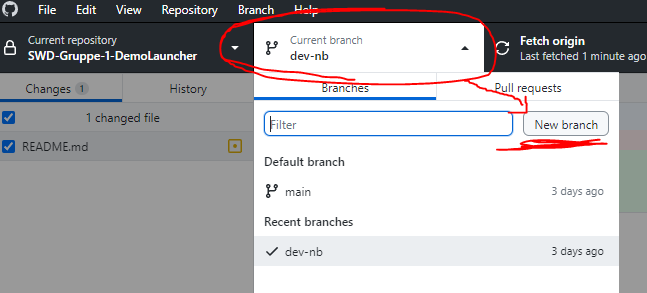
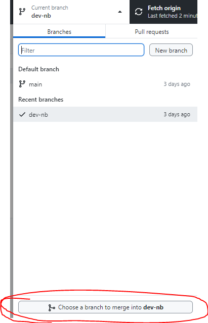

# SWD-Gruppe-1-DemoLauncher

## Branches:
When you want to work with this repo, please create your own Branch first.
This way we dont accidentally overwrite each other.

### This is how to create your branch in Github Desktop:

The workflow goes like this:
We work on some feature on our branch, then we commit and push it, and after that
we merge the main branch into our branch.
This way we get all the changes from everyone else into our branch, and the main branch gets our changes.
If two or more people worked on the same line of code, we get a merge conflict, and can manually
decide which version we want to use further on.

### In Github Desktop you can merge with this Button:

